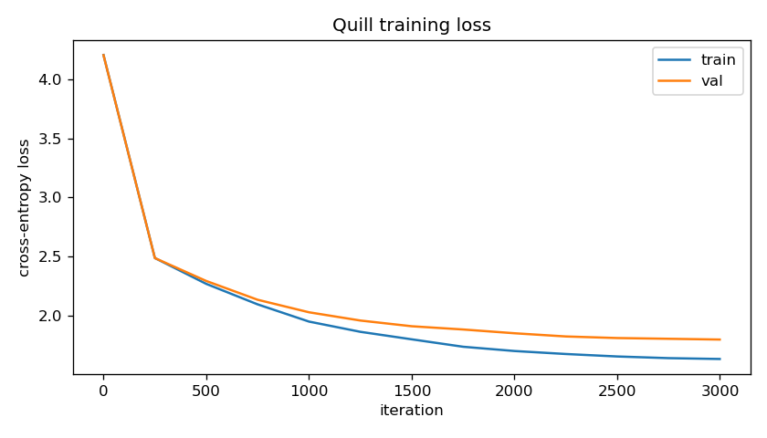

# quill — a GPT-style transformer built from scratch

A decoder-only transformer language model where the attention mechanism and
LayerNorm are written out at the tensor-op level — not `nn.MultiheadAttention`,
not `F.scaled_dot_product_attention` — trained end-to-end on character-level
Shakespeare. PyTorch still handles autograd (reimplementing backprop by hand
wouldn't teach anything the forward pass doesn't already), but nothing about
*how attention computes its output* is hidden behind a library call.

## Why from scratch

It's easy to get a transformer training by calling `nn.TransformerEncoderLayer`
without ever understanding what happens inside it. This project exists to
prove the opposite: every matmul in `softmax(QK^T / sqrt(d)) V`, the causal
mask, multi-head reshaping, and LayerNorm's mean/variance normalization are
all written by hand in `quill/`, and tested against the properties that make
them correct — not just "it runs."

## Architecture

```
tokens ─▶ token_emb + pos_emb ─▶ [ pre-LN block ] x n_layer ─▶ LayerNorm ─▶ lm_head ─▶ logits
                                       │
                         x + attn(LN(x))   — manual multi-head causal self-attention
                         x + mlp(LN(x))    — 4x-expansion GELU feedforward
```

- **`quill/attention.py`** — `CausalSelfAttention`: manual QKV projection, per-head
  reshape, `(q @ k.T) / sqrt(head_dim)`, causal mask, softmax, `@ v`. No fused kernel.
- **`quill/layers.py`** — `LayerNorm`: mean/variance normalize + learned affine, by hand.
- **`quill/block.py`** — pre-LN transformer block (GPT-2-onward convention: normalize
  *before* the sub-layer, not after — keeps gradients well-behaved at depth).
- **`quill/model.py`** — `GPT`: embeddings, block stack, weight-tied output head,
  GPT-2-style scaled residual-projection init, `generate()` with temperature/top-k sampling
  and an optional KV-cache for faster autoregressive decoding (see below).

## Quick start

```bash
pip install -r requirements.txt
python -m pytest tests/ -q      # 23 tests: causality, LayerNorm correctness, overfit sanity, KV-cache equivalence, top-p sampling
python train.py                 # ~14 min on Apple Silicon MPS, 3000 iterations
python generate.py --prompt "ROMEO:"
python generate.py --prompt "ROMEO:" --use_cache   # same output, faster (see KV-cache below)
python generate.py --prompt "ROMEO:" --top_p 0.9   # nucleus sampling, composes with --top_k
```

(`./run.sh` / `run.bat` do venv + deps + tests + training in one step.)

## Tests (`make` not required — `python -m pytest tests/`)

The tests prove the "from scratch" claims rather than just checking the code runs:

| Test | What it proves |
|---|---|
| `test_matches_pytorch_layernorm_numerically` | The hand-written LayerNorm produces numerically identical output to `nn.LayerNorm` given the same weights — not just "runs," but *correct*. |
| `test_causal_mask_blocks_future_positions` | Perturbing only the **last** token's input leaves every earlier position's attention output byte-for-byte unchanged — the defining property of causal attention, checked directly rather than trusted from the mask math. |
| `test_attention_weights_are_causal_and_normalized` | Inspects the actual attention weight matrix: zero mass on future positions, each row sums to 1. |
| `test_model_can_overfit_a_tiny_repeated_sequence` | The single most useful sanity check in ML: a model that can't memorize an 8-token pattern in 200 steps has a bug in forward/backward, no amount of real data will fix it. |
| `test_lm_head_is_tied_to_token_embedding` | Weight tying is actually wired up (`is`, not just equal-valued). |
| `test_generate_appends_exactly_max_new_tokens` | Autoregressive generation produces exactly the requested length, tokens in-vocab. |
| `test_cached_generation_matches_uncached_token_ids` / `..._on_trained_checkpoint` | KV-cached generation produces byte-for-byte identical token IDs to the uncached path — on a random toy model and on the real trained checkpoint — under greedy decoding. |
| `test_cached_logits_match_uncached_logits_at_each_step` | The cached path's logits at each step match a full from-scratch recompute over the same growing sequence, within float tolerance. |
| `test_top_p_never_produces_an_empty_candidate_set` | Across p from 0.0 to 1.0 on random logits, the nucleus is never empty — a filtering bug here would either crash `softmax` on an all -inf row or silently degrade to always-argmax. |
| `test_low_top_p_with_greedy_equivalent_seed_still_matches_argmax_choice` | A vanishingly small `top_p` collapses the nucleus to exactly the single most likely token, so sampling from it must equal `argmax` — checked directly, not assumed. |
| + gradient-flow and shape tests | Every parameter in attention receives a gradient; output shapes match input shapes throughout. |

## KV-cache

`generate()` accepts `use_cache=True` (default `False`, to keep the original
behavior/API untouched for existing callers). Without it, every new token
reruns full attention over the *entire* sequence generated so far — quadratic
work across a generation. With it, `CausalSelfAttention` caches each layer's
key/value tensors and each new token only computes attention for its one new
query against the cached history, so per-step cost stops growing with how
much has already been generated.

Correctness is the part that actually matters here — a caching bug that
silently produces different tokens would be far worse than no cache at all —
so it's checked three ways in `tests/test_generation_cache.py`: exact
token-ID equality under greedy decoding (both on a toy model and on the real
trained checkpoint), step-level logits closeness against a full recompute,
and a cache-growth shape check.

Measured with `benchmark_cache.py` against the trained checkpoint (4 layers,
128-dim, block_size 128) generating 127 tokens on Apple Silicon MPS,
best-of-5: **1.2x** wall-clock speedup. That's real but modest — expected at
this scale: `block_size=128` means even the "quadratic" uncached path is only
recomputing attention over a couple hundred positions at most, so there isn't
much redundant work to eliminate yet, and MPS's per-op dispatch overhead cuts
into the savings when each cached step is a smaller op. The win from KV-
caching grows with context length; it would be far more pronounced at the
several-thousand-token contexts real LLMs run at, which is exactly why every
production inference stack uses one.

**Limitation:** unlike the uncached path (which silently slides its context
window over the most recent `block_size` tokens once a generation outgrows
it), the cached path has no sliding-window eviction — `len(prompt) +
max_new_tokens` must fit within `block_size`, or `generate(..., use_cache=
True)` raises an assertion rather than producing quietly-wrong output.

## Sampling: top-k and top-p

`generate()` supports temperature, top-k, and now nucleus (top-p) sampling,
and they compose: top-k (if set) narrows the vocabulary to the k
highest-probability tokens first, then top-p (if set) further narrows
*that* set to the smallest prefix whose cumulative probability covers `p`,
before the final softmax/sample. Either can be used alone or disabled
(`None`).

The nucleus construction (`GPT._top_p_filter`) sorts logits descending,
takes a cumulative sum of their softmax probabilities, and masks every
token past the point where that cumulative sum first covers `p`. The token
that pushes the sum past `p` is always kept, so the candidate set is never
empty — even a `top_p` near 0 on a sharply peaked distribution still keeps
the single dominant token rather than masking everything to `-inf` and
handing `softmax` a degenerate row. `tests/test_top_p.py` checks this
directly (peaked-distribution collapse, empty-set guard across the full
`[0, 1]` range, and composition with top-k), not just "the shapes work out."

Real output from the trained checkpoint (`generate.py --prompt "ROMEO:"
--max_new_tokens 100`, no fixed seed, so exact text varies run to run —
these are actual single runs, not cherry-picked):

```
top_k=40 only:
ROMEO:
Go; for not plaur not to me; thou she his holder a
Were a this that of'er diver that trive coase at

top_p=0.9 (top_k disabled):
ROMEO:
And the do come was now you the dayspt of you,
Make with have the mark'd will your much to so thee;

top_p=0.5 (tighter nucleus):
ROMEO:
The so man his her be of my be a brother,
And stranger and the the shall shall have the heart
And b
```

Honestly: at this model's scale (4 layers, 128-dim, character-level, ~14 min
of training) none of these read as meaningfully more "coherent" than the
others — the model hasn't learned enough structure for sampling strategy to
be the dominant factor in output quality yet. The one real, repeatable
pattern across several runs: the tighter `top_p=0.5` nucleus visibly repeats
short words more often ("the the shall shall") than `top_p=0.9`, which
tracks with nucleus sampling's known tradeoff (a smaller candidate set is
more prone to locking onto a locally-likely loop) — but this is a
small-model, short-training-run observation, not a claim that top-p
"fixes" quality here. Its real value is the same as in production LLM
serving: a tunable diversity/reliability knob, demonstrated correct on a
project small enough to verify by hand.

## Training run (this repo's actual numbers)

3000 iterations, batch size 64, block size 128, 4 layers / 4 heads / 128 embedding
dim (~800K non-embedding parameters), AdamW with cosine LR decay + warmup, on
Apple Silicon MPS:

```
step     0 | train 4.2052 | val 4.2036 | lr 1.50e-06
step   250 | train 2.4879 | val 2.4878 | lr 3.00e-04
step  1000 | train 1.9506 | val 2.0291 | lr 2.49e-04
step  2000 | train 1.7016 | val 1.8518 | lr 1.06e-04
step  2999 | train 1.6342 | val 1.7986 | lr 3.00e-05
```



Sample generation at the end of this run (temperature 0.8, top-k 40):

```
CHINRY GRITHARD II:
Comest in of love he croince the the art,
Have she ince of the have of the, sir, and that yet
mreas?

PALINA:
See to may couselve you wilt the duke is on be come.

HASTINIUS Edward; that I do desce, mo them, the put this cous,
Or that with he may hreart stand feear they stand;
And and yet but serving of the quin's the king hoave fair,
```

**Honest read of this output:** it has correctly learned Shakespeare's *surface
structure* — character-name headers in caps followed by a colon, verse-like
line breaks, archaic diction ("thou," "hath"-adjacent forms), blank lines
between speaker turns — but the actual words are frequently non-words or
garbled ("croince," "hreart"). That's expected and consistent with published
char-level results at this scale: this is an ~800K-parameter model trained for
3000 steps on 1MB of text, not a production language model. nanoGPT's own
char-Shakespeare configs use a larger model and 5000+ iterations to bring val
loss down toward ~1.4-1.5, where output starts forming mostly-real words.
Val loss of 1.80 here is in the right range for this much smaller/shorter
training budget, and the loss curve (linked above) is still trending down at
step 2999 — this is an undertrained-by-design demo, not a converged model.

## Honest caveats

- **Character-level, not subword.** No BPE/tokenizer training — the vocabulary
  is just the corpus's unique characters (65 for Shakespeare). This keeps the
  whole tokenizer reconstructible from one text file, at the cost of needing
  more tokens (and more training) to reach fluent output than a subword model
  would.
- **Small by design.** 4 layers, 128-dim embeddings, ~800K parameters — sized to
  train on a laptop in minutes, not to produce publication-quality text. The
  architecture (attention, LayerNorm, blocks) is what's "from scratch," not
  the scale.
- **KV-cache has no sliding-window eviction.** `generate(..., use_cache=True)`
  requires the prompt plus everything generated to fit within `block_size` —
  see the KV-cache section above.
- **Dataset:** `data/tinyshakespeare.txt` is the standard "Tiny Shakespeare"
  corpus (public-domain text, commonly redistributed for exactly this kind of
  char-level LM tutorial/benchmark — e.g. Karpathy's char-rnn and nanoGPT both
  bundle the same file).

## Layout

```
quill/
  config.py      GPTConfig dataclass
  tokenizer.py   character-level encode/decode, vocab saved to json
  layers.py      hand-written LayerNorm
  attention.py   hand-written multi-head causal self-attention
  block.py       pre-LN transformer block (attention + MLP + residuals)
  model.py       GPT: embeddings, block stack, generate()
  dataset.py     random contiguous-window batching
tests/           causality, LayerNorm-equivalence, overfit sanity check, generation, KV-cache, top-p sampling
data/            tinyshakespeare.txt
train.py         full training loop, loss curve, checkpoint
generate.py      sample from a saved checkpoint (--use_cache for KV-cached decoding, --top_p for nucleus sampling)
benchmark_cache.py   measures real wall-clock cached vs. uncached generation speedup
```
